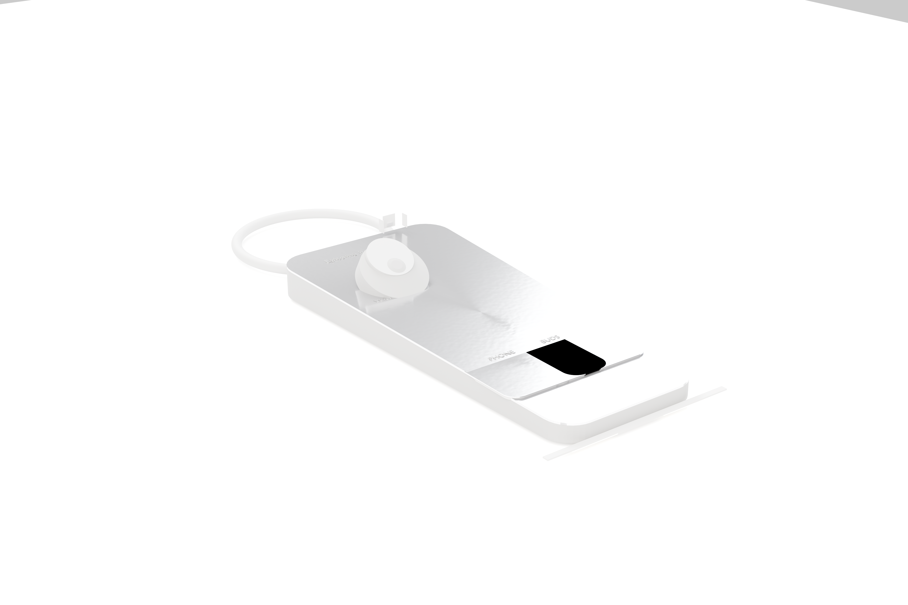

# Penta Dock

## Product Render


> Pre-generated. Regenerate at any time by running `blender --background --python scripts/generate_render.py`.

## 3D Model
Open [`assets/epitome-penta-model.glb`](assets/epitome-penta-model.glb) to view the interactive 3D model in GitHub.

**One dock. Every device.**

*190W total output — laptop, tablet, phone, watch, buds, all at full speed.*

---

## Overview

Penta Dock is a 5-zone charging dock that powers laptop, tablet, phone, watch, and buds (or a second phone) simultaneously from a single wall outlet.

## Power Budget

| Zone | Device | Power | Method |
|---|---|---|---|
| Zone 1 | Phone | 20W | Qi2 (magnetic alignment) |
| Zone 2 | Buds or second phone | 20W | Qi |
| Zone 3 | Watch | 5W | Apple Watch puck + Qi coil |
| Zone 4 | Laptop | 100W | USB-C PD (captive braided cable) |
| Zone 5 | Tablet | 45W | USB-C PD (captive braided cable) |
| **Total worst case** | | **190W** | |
| **PSU rated** | | **201W (Mean Well LRS-200-24)** | |
| **Headroom** | | **11W** | |
| **ATtiny85 soft cap** | | **185W** | |

## Wattage Etch Labels

```
PHONE    20W  Qi2
BUDS     20W  Qi
WATCH     5W
LAPTOP  100W  USB-C
TABLET   45W  USB-C
```

## Key Features

- **190W simultaneous output** across 5 zones
- **Zone 1:** 20W Qi2 with magnetic alignment
- **Zone 2:** 20W Qi on an enlarged 120×80mm dish for buds or a second phone
- **Zone 3:** 5W Apple Watch puck + Qi watch coil
- **Zone 4:** 100W USB-C PD captive braided cable
- **Zone 5:** 45W USB-C PD captive braided cable
- **Zone 5 cable:** 200mm braided nylon, 65W rated
- **Primary slogan:** **One dock. Every device.**
- **Secondary tagline:** **190W. Five zones. One cable.**

> Zone 2's enlarged 120×80mm surface fits a buds case or a full-size phone — charge for two people from one dock.

## Documentation

| Doc | Contents |
|-----|----------|
| [Electronics Spec](docs/electronics.md) | Charging architecture and power budget |
| [Bill of Materials](docs/bom.md) | Component and cost breakdown |
| [UVP](docs/uvp.md) | Positioning, messaging, and claims |
| [Component Positions](docs/component-positions.md) | Definitive X/Y/Z coordinates |
| [Compatibility](docs/compatibility.md) | Device support matrix |

*Built by GJATHASEnterprises*
