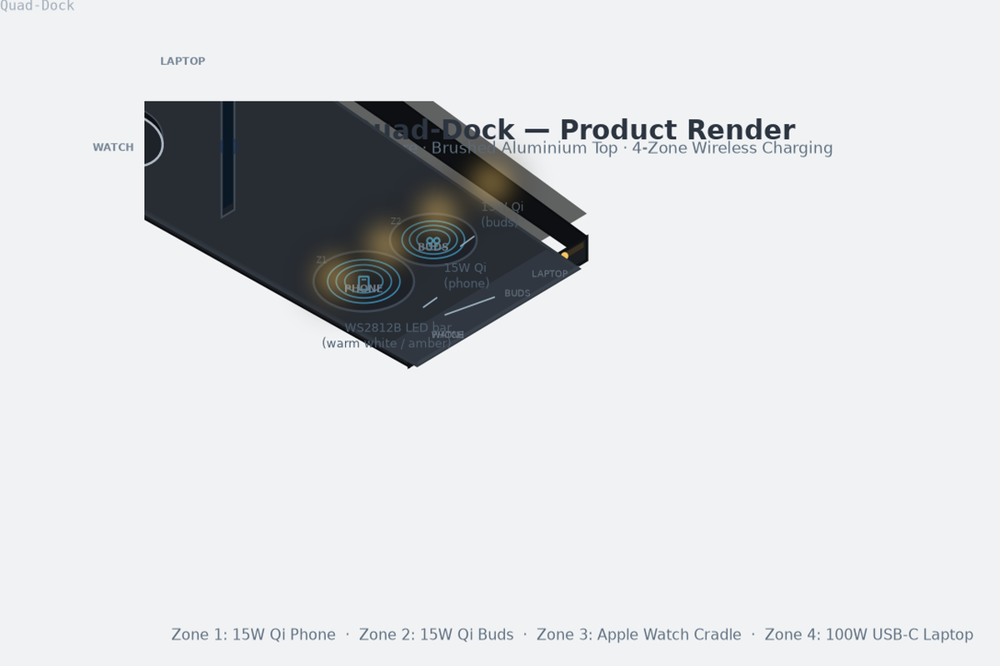

# Quad-Dock

## Product Render


> Pre-generated. Regenerate at any time by running `python scripts/generate_image.py`.

## 3D Model
Open [`assets/quad-dock-model.glb`](assets/quad-dock-model.glb) to view the interactive 3D model in GitHub — rotate, zoom, and inspect from any angle. Always reflects the latest design.

> Pre-generated. Regenerate at any time by running `python scripts/generate_3d_model.py`.

**A smart, app-controlled 4-zone charging dock for phones, Apple Watch, AirPods, and laptops.**

---

## Overview

Quad-Dock is a self-built, smart charging station that charges up to 4 devices simultaneously from a single wall outlet. It features a brushed aluminum top plate in the "Arc" enclosure — a smooth curved wedge with zero sharp corners — dual 15W Qi wireless coils, a built-in Apple Watch puck, 100W USB-C PD for any modern laptop, a WS2812B LED status bar with laser-etched zone icons, and a companion iOS app with theft alerts, ambient light dimming, and weekly charge reports.

Plugs directly into the wall via a built-in IEC C13 inlet and internal 180W AC/DC power supply — no external power brick required.

Available in **Black** and **White**.

---

## 4-Zone Layout

```
+-----------------------------------------------------------+
|  REAR                                                     |
|  ┌─────────────────────────────────────────────────────┐  |
|  │  [⌚ ZONE 3 — Watch]      [💻 ZONE 4 — Laptop]      │  |
|  │  Teardrop cradle           Vertical spine groove    │  |
|  │  30° tilt, rear-left        rear-right, 22×12mm     │  |
|  └─────────────────────────────────────────────────────┘  |
|  ┌─────────────────────────────────────────────────────┐  |
|  │  [📱 ZONE 1 — Phone]       [🎧 ZONE 2 — Buds]       │  |
|  │  15W Qi + magnets          15W Qi, phones/AirPods   │  |
|  └─────────────────────────────────────────────────────┘  |
|  [■■■■ PHONE ■■■■|■■■■ BUDS ■■■■|■■■■ WATCH ■■■■|■■ LAPTOP ■■] LED bar
+-----------------------------------------------------------+
  FRONT                              IEC C13 inlet (rear)
```

---

## Key Features

- **4 devices at once** — 3 phones simultaneously, Apple Watch, and any modern laptop
- **100W USB-C PD** on Zone 4 — works with any USB-C laptop from the last 6 years
- **Dual 15W Qi** on Zones 1 + 2 — fast wireless charging for phones and AirPods
- **Apple Watch puck** built-in on Zone 3 — no adapter needed
- **Arc enclosure** — smooth curved wedge, brushed aluminum top, soft-touch ABS base, zero sharp corners
- **WS2812B LED bar** with frosted diffuser and laser-etched zone icons (📱 PHONE, 🎧 BUDS, ⌚ WATCH, 💻 LAPTOP)
- **LED states:** Red = charging, Green = full, Off = empty
- **Companion iOS app** — theft alerts, ambient auto-dim, BLE proximity, weekly charge reports, home screen widget
- **ESP32-C3 Mini** MCU — WiFi + BLE, flashed via onboard USB
- **Internal 180W PSU** — no external power brick
- **No physical buttons** — all control via app

---

## Compatibility

See [docs/compatibility.md](docs/compatibility.md) for the full list. Quick summary:

- **Phones:** iPhone (any Qi-capable), Android (any Qi), Zone 4 USB-C for any phone
- **Laptops:** MacBook Air, MacBook Pro, Dell XPS, HP Spectre, Lenovo ThinkPad/IdeaPad, ASUS, Acer, Surface Pro, Samsung Galaxy Book, any USB-C laptop (2018+)
- **Apple Watch:** Series 1–9, SE, Ultra
- **AirPods:** Pro (1st/2nd gen), 3rd gen, AirPods 4 (Qi case)
- **iPad:** iPad Pro, Air, mini (USB-C models via Zone 4)

---

## Pricing

| Color | Price |
|-------|-------|
| Black | $189 |
| White | $189 |

---

## Documentation

| Doc | Contents |
|-----|----------|
| [Enclosure Spec](docs/enclosure.md) | Arc design, dimensions, materials, zones, LED system |
| [Electronics Spec](docs/electronics.md) | ESP32-C3, all ICs, power architecture, sensors |
| [App Spec](docs/app-spec.md) | iOS app features, theft alerts, BLE, notifications |
| [Bill of Materials](docs/bom.md) | Prototype + production BOM, cost breakdown |
| [Compatibility](docs/compatibility.md) | All supported devices and charge speeds |
| [Production Roadmap](docs/production-roadmap.md) | Batch 1 laser cut → batch 2 mold → batch 3+ |
| [Prototype Guide](docs/prototype-guide.md) | 4-week build plan, tools, checklist |
| [Marketability](docs/marketability.md) | Selling points, target markets, pricing rationale |
| [Wiring Notes](docs/wiring.md) | Schematic notes, pin assignments, PCB notes |

---

## Target Build Cost

| Quantity | Target BOM |
|----------|-----------|
| 20–50 units | ~$75–$85 (laser cut batch) |
| 50 units | ~$67 (with bulk sourcing) |
| 100+ units | ~$64 |

---

*Built by GJATHASEnterprises*
