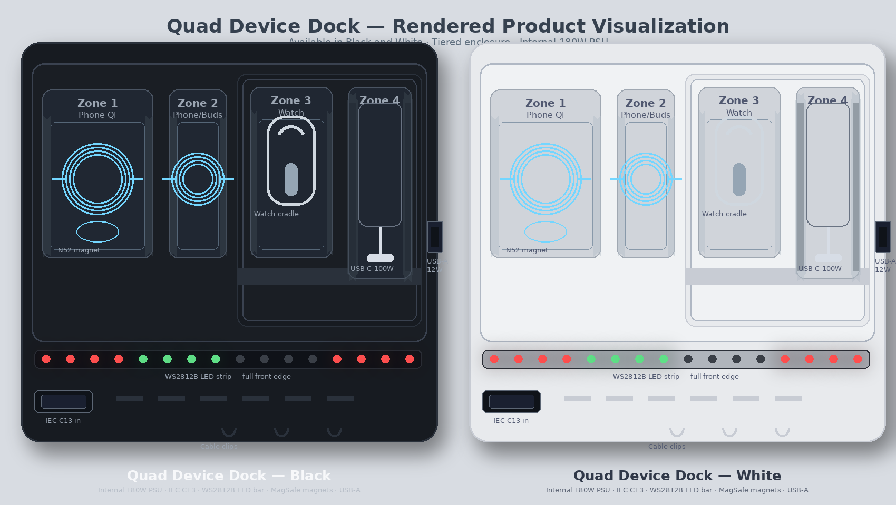

# Quad Device Dock — Layout Diagram



---

## Top View (Surface Layout)

```
+============================================================================+
|                                                                            |
|   QUAD DEVICE DOCK                                            [LOGO]       |
|                                                                            |
|  ┌─────────────────────────────────────────────────────────────────────┐  |
|  │  REAR TIER (40mm high)                                              │  |
|  │  /+--------+\                            /+--------------+\         │  |
|  │  || ZONE 3 ||                            ||   ZONE 4     ||         │  |
|  │  || Watch  ||                            || USB-C Laptop ||         │  |
|  │  || cradle ||                            || upright slot ||         │  |
|  │  \+--------+/                            \+--------------+/         │  |
|  └─────────────────────────────────────────────────────────────────────┘  |
|  ┌─────────────────────────────────────────────────────────────────────┐  |
|  │  FRONT TIER (15mm high)                                             │  |
|  │  /+----------+\  /+----------+\                                     │  |
|  │  || ZONE 1   ||  || ZONE 2   ||                                     │  |
|  │  || Phone Qi ||  || Phone /  ||                                     │  |
|  │  ||  (coil)  ||  || AirPods  ||                                     │  |
|  │  \+----------+/  \+----------+/                                     │  |
|  └─────────────────────────────────────────────────────────────────────┘  |
|  [========= WS2812B LED BAR — full front edge (16 LEDs) ================] |
+======= [IEC C13 in (rear left)] =============================[USB-A side]=+
```

---

## Side Profile View

```
Rear (40mm)             Step             Front (15mm)
                          |
[Watch Zone 3]            |    [Phone Zone 1]  [Phone/Buds Zone 2]
[Laptop Zone 4]           |           |               |
        |                 |      ABS rails        ABS rails
        |              ===|===================================
+-------+---(rear tier)===+===(front tier)------------------+
|  Internal PSU  |  PCB  | [Qi coil 1] | [Qi coil 2] | PCB |
| INA3221 INA219 |  ESP32 |  [INA3221]  |  [INA3221]  |     |
+----------------+--------+-------------+-------------+-----+
     |___ IEC C13 inlet (rear) ___| |___ USB-A port (right side) ___|
                                  |
          [WS2812B LED strip — front edge, full width]
```

---

## Internal Component Layout (Top-Down PCB View)

```
+========================================================================+
| [IEC C13 Inlet] → [180W AC/DC PSU Module] → [Main 20V Rail]           |
|                                       |                                |
|    +----------------------------------+                                |
|    |            |            |             |            |              |
| [Qi TX 1]   [Qi TX 2]   [Watch Mod]   [USB-C PD Out]  [SY6280]        |
| (15W, Z1)   (15W, Z2)   (5W, Z3)      (100W, Z4)     (12W USB-A)      |
|    |            |            |             |                           |
| [INA3221 ch1] [INA3221 ch2] [INA3221 ch3] [INA219]                    |
|    |            |            |             |                           |
|    +------+-----+------------+-------------+                           |
|           |                                                            |
|        [I2C Bus: GPIO 21/22]                                           |
|           |                                                            |
|      [ESP32-WROOM-32]                                                  |
|           |               |               |                            |
|    [BLE / WiFi]    [GPIO 12 → WS2812B]   [ADC: GPIO 36 (ambient)]     |
|                                           [ADC: GPIO 34/35/32/33 (NTC)]|
|                                                                        |
| [WS2812B LED strip — 16 LEDs — front edge full width]                  |
| [Zone 1: LEDs 0–3] [Zone 2: LEDs 4–7] [Zone 3: LEDs 8–11] [Z4: 12–15] |
+========================================================================+
```

---

## Guide Rail Dimensions

| Zone | Rail Material | Height | Notes |
|------|---------------|--------|-------|
| Zone 1 | Integrated molded ABS | Small | Centers phone on Qi coil; silicone pad on surface |
| Zone 2 | Integrated molded ABS | Small | Works for phone or AirPods case; silicone pad |
| Zone 3 | Integrated molded ABS | Small | Lower profile to avoid interfering with watch band; silicone pad; elevated on rear tier |
| Zone 4 | Integrated molded ABS + silicone inserts | 40–50mm | Supports laptop upright at ~75° from horizontal; silicone inner pads protect laptop edges |

---

## Enclosure Dimensions (Target)

```
          320mm
+------------------------+
|                        |  Rear tier: 40mm
|     [Z3]     [Z4]      |  ← elevated / stepped up
+------------------------+  ← step (30mm rise over 20mm depth)
|  [Z1]   [Z2]           |  Front tier: 15mm
|  [LED BAR — full width]|
+------------------------+  ← bottom
  130mm width
```

---

## Zone Spacing (Center-to-Center)

| Zones | Center-to-Center Distance |
|-------|---------------------------|
| Z1 to Z2 | 70mm |
| Z2 to Z3 | 65mm |
| Z3 to Z4 | 75mm |

---

## LED Strip Key

| State | LED Segment Color | Meaning |
|-------|-------------------|---------|
| Charging | Red | Device is actively charging on that zone |
| Full | Green | Device is fully charged on that zone |
| No device | Off | No device detected on that zone |
| All zones full | Full bar pulses green (breathing) | All 4 zones simultaneously at 100% |
| Dark mode | All off | App has forced LEDs off |

---

## Notes
- Guide rails on Zones 1–3 are integrated ABS (same piece as the base) — clean look, no separate acrylic parts to break or misplace
- Zone 3 watch cradle is recessed and sits elevated on the rear tier for clean visual separation
- Zone 4 USB-C cable exits from the front-right edge or terminates in a flush USB-C port depending on enclosure revision
- The WS2812B LED strip runs the full front width behind a frosted diffuser for a soft, continuous glow
- Rubber feet (×4) on underside and cooling vent slots in base provide grip and passive airflow
- IEC C13 inlet is on the rear left; USB-A port is on the right side panel
- Aluminum top plate is secured with M3 screws and is removable for DIY repair access
- Available in Black and White colorways (same enclosure design)
